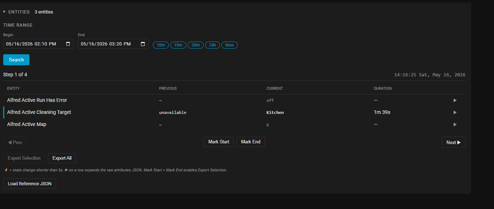

# Usage



This card is a **state viewer**, not a history viewer. They sound similar
and read the same recorder data, but they answer different questions.

- **History viewer** (HA's built-in chart): values over time. "Where did
  battery level go this week?" "Plot kitchen temperature."
- **State viewer** (this card): transitions between states across
  multiple entities at once. "What did the vacuum, dock status, charging
  state, and error flag all do at the moment the run completed?"

If you want a chart, use HA's history viewer. If you want a stepper-style
multi-entity correlated view of state transitions, you're in the right
place.

The two tools are complementary, not competing. A common workflow:

1. Use this card to find the **exact moment** of the event you care
   about — step through correlated transitions until you locate it.
2. Note the timestamp and the entities involved.
3. Switch to HA's history viewer and its **CSV export** for the precise
   data slice — now that you know the window and the entities, HA's
   built-in tooling gives you the data in the format other tools want.

CSV export isn't in this card by design. By the time you know what
you'd export, you already have a better tool for it.

## Concepts

### Driver entity

You can mark one entity as the **driver** (★). The driver row always
appears first in the stepper table regardless of selection order, and
the driver's friendly name becomes the export filename prefix. A driver
is optional — queries work without one — but if you're investigating
a specific entity (e.g. `sensor.vacuum_status`) and want it pinned to
the top, set it as the driver.

### Step

One step represents one moment when at least one selected entity
changed state. Each step shows:

- The timestamp the change happened, in your HA instance's timezone
- Which entity changed (the "changed entity")
- A snapshot of every selected entity's state at that exact moment,
  with previous state and how long it had been in the current state

Walking forward and backward through steps gives you the per-event
view that the history viewer's per-entity chart can't.

**Note on `previous_state: null`.** At the first step in a search
window, any entity whose state hadn't been observed before will show
`previous_state` as `null` — there's nothing before the start of the
window to compare against. Once an entity has had at least one
transition inside the window, subsequent steps show its actual prior
state. This is expected; it's not a missing-data bug.

### Marks and export

Mark Start and Mark End define a slice of steps. Once both are set,
Export Selection writes that slice as JSON. Export All writes everything
in the current search.

The exported file is a complete record of every state at every step in
the range — see [EXPORT_FORMAT.md](EXPORT_FORMAT.md) for the schema.

### Reference timeline (twin stepper)

Loading a previously exported JSON splits the panel into two steppers
side by side. Each has its own ◀ / ▶ navigation. There is no automatic
alignment between the two — timestamps and durations drift between
runs, so pattern-matching is left to your eye, which is faster and more
accurate than any heuristic.

## Basic workflow

1. **Pick a device** from the dropdown. The card lists its entities
   grouped by domain. Check the ones you want included.
2. **Add individual entities** with the "Add entity" input if they
   aren't tied to the device, or to combine entities from multiple
   devices in one search.
3. **Set the time range**. The presets (10m, 15m, 20m, 24h, Now) cover
   the common cases. For a specific incident, click into the datetime
   inputs.
4. **Click Search**. The card queries the HA recorder and renders the
   stepper.
5. **Step through.** ◀ Prev / Next ▶ moves between events. Watch every
   selected entity's row update as you step.
6. **Expand a row** (▶ on the right edge) to see the full attribute JSON
   for that entity at that step.
7. **Mark Start + Mark End** on the steps that bound the interesting
   slice. **Export Selection** writes the slice to a file. **Export All**
   writes everything.

## Workflow A: Capture a derived-state signature

You want a sensor for "X happened" but no single entity reports X.
Examples: dishwasher actually finished, garage open with no car, kid
went to bed, vacuum stuck mid-run.

1. Pick the entities that you suspect are involved. Don't try to be
   minimal — over-include and let the card show you which ones
   actually transition.
2. Search a time range containing a known instance of the event.
3. Step through. Note which entities transition during the moment X
   happens, in what order, and how close together in time.
4. Mark Start at the first transition, Mark End at the last, and export.
5. The exported JSON is your **signature**: the canonical sequence of
   state transitions that defines X.
6. Translate that signature into HA: usually a `trigger`-based
   `binary_sensor` or `template` that watches the same entities for
   the same transitions in the same order/timing.

### Worked example: Alfred vacuum clean-completion

A real five-event signature captured 2026-05-16 from the integration
this card was originally built to debug:

| Δt | Entity | Transition |
|---|---|---|
| 0 | `binary_sensor.alfred_charging` | `off` → `on` (dock contact) |
| +2002ms | `vacuum.alfred` | `returning` → `docked` |
| +2003ms | `sensor.alfred_task_status` | `Returning` → `Completed` |
| +2003ms | `sensor.alfred_work_mode` | `Room` → `unknown` |
| +2032ms | `binary_sensor.alfred_active_run_has_error` | `on` → `off` |

The Alfred firmware has no `job_complete_and_clean` entity. The single
most reliable trigger derived from this signature:

```yaml
trigger:
  platform: state
  entity_id: binary_sensor.alfred_active_run_has_error
  to: 'off'
condition:
  - condition: state
    entity_id: vacuum.alfred
    state: docked
  - condition: state
    entity_id: binary_sensor.alfred_charging
    state: 'on'
  - condition: state
    entity_id: sensor.alfred_task_status
    state: Completed
```

That fires exactly once per clean run, ~2 seconds after dock contact,
only when the run genuinely ended without an unresolved error.

You wouldn't find this trigger by guessing. You'd find it by capturing
a clean completion in the card, looking at the export, and seeing which
entities all transitioned within the same ~2-second window.

## Workflow B: Port an integration

You're writing or porting an HA integration for a device (vacuum,
thermostat, appliance — anything with a state machine). You want your
integration to expose entities that map to a canonical event grammar
that other automations can consume.

1. **Capture canonical events on a known-good device.** For each event
   you care about (job complete, error, started, paused), record a
   reference signature with this card.
2. **Set up the new device with its raw entities.** They'll usually
   have different names, different state vocabularies, different
   attribute shapes.
3. **Trigger the same canonical event on the new device.** Load the
   reference JSON for that event into the twin stepper.
4. **Step through both side by side.** When the new device reaches the
   analogous moment, identify which of its entities make the same kind
   of transitions the reference's entities did.
5. **Write the mapping into your integration code.** Translate the
   device's native state events into the canonical entity set your
   reference defines.

The reference panel is intentionally not auto-aligned with the live
stepper. Timestamps and durations differ between devices and between
runs of the same device. Manual side-by-side scanning is the right
tool here.

## Configuration

| Key | Default | Description |
|---|---|---|
| `fast_flip_threshold_seconds` | `5` | A state with a duration below this gets the ⚡ flag and a row highlight. Useful for spotting bouncing sensors. |
| `recorder_keep_days` | `10` | Match your recorder `purge_keep_days`. The card warns when Begin falls past this cutoff so empty results aren't silent. |

Both are editable through the card's visual editor (gear icon when
editing a card) as well as YAML.

HA does not expose the recorder's real `purge_keep_days` to the
frontend — there's no websocket call or REST endpoint for it. The card
can't auto-detect your setting. If you've changed it from the default,
tell the card by setting `recorder_keep_days` so the retention warning
fires at the right cutoff.

## Known limitations

- **No alignment between live and reference timelines.** By design.
  Multi-run pattern matching is left to the human eye because automated
  alignment misleads when durations drift.
- **Recorder retention is a hard floor.** You can't query past your
  `purge_keep_days`. The card warns when Begin falls past the configured
  cutoff but it cannot recover purged data.
- **No mobile optimization.** Desktop assumed. The stepper table is too
  dense for phone screens.
- **No automated diff** between two timelines. Side-by-side twin
  stepper, you walk them. See above.
- **Entity selection persists per-origin via localStorage** — same HA
  instance + same browser remembers your selection. Step cursors,
  marks, and any loaded reference timeline do NOT persist; they reset
  every reload. That's intentional — they're session-local to a
  specific investigation.
- **Times always use HA's configured timezone**, never the browser's.
  If you're investigating an event remote from your HA server, the
  timestamps you see match what you'd see in HA's logs.
